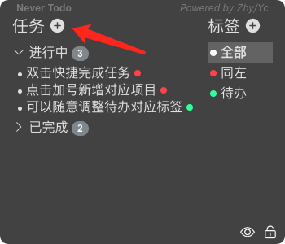
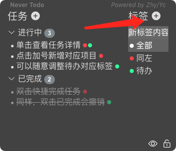
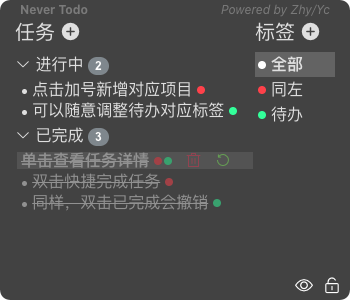
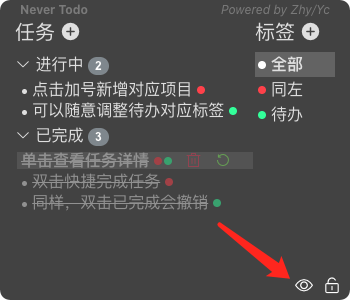
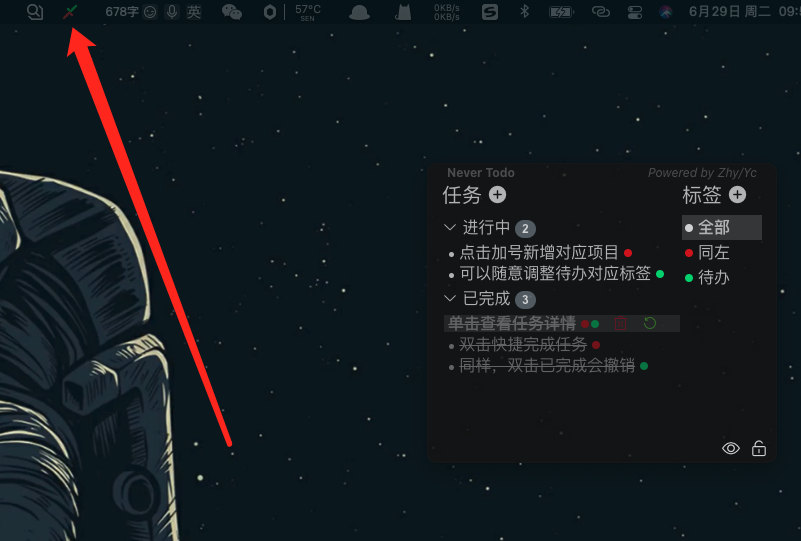
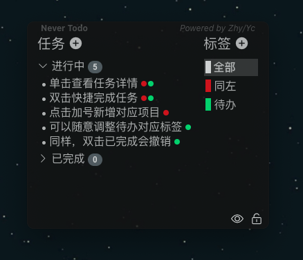

<div align=center></div>

# never-todo-client

> 一个基于electron-vue框架搭建的待办列表应用

此应用由[SpicyChickenFLY](https://github.com/SpicyChickenFLY)与[bluepongo](https://github.com/bluepongo)合作开发

这个应用被分为四部分
* [后端数据库（开发中）](https://github.com/SpicyChickenFLY/never-todo-backend) - 使用Golang进行开发
* [前端Web页面（开发中）]() - 使用Vue进行开发，可能会用dart写Vue
* [PC端（Win/Linux/Mac）（发布v0.0.1）](https://github.com/bluepongo/never-todo-client)- 使用Electron-Vue框架搭建
* [移动端（Android/IOS）（尚未开发）](https://github.com/SpicyChickenFLY/never-todo-mobile) - 使用Dart/Flutter搭建

PC端的设计思路和逻辑编写的大量灵感来自于[xhznl-todo-list](https://github.com/xiajingren/xhznl-todo-list)这个仓库，这个APP做的特别棒，但是因为没有标签功能所以我们重新设计了一个

## 使用方法

### 添加任务



点击左侧"+"号，然后输入任务内容即可。

### 查看任务


单击【进行中】的任务即可查看任务详情。点击右边标签可以对具体任务设置标签。点击黄色星星按钮可将任务设置为重要事项；点击垃圾桶可删除任务；点击对勾或者双击任务可以完成任务。

### 添加标签



点击右侧"+"号可以添加标签，输入标签内容即可。

### 撤回已完成任务



点击绿色撤回按钮或双击任务，可将【已完成】任务撤回【进行中】。

### 最小化



点击左下角小眼睛图标即可。若想重新唤出界面，点击上方小图标（windows系统为右下角任务栏小图标）-显示界面。

### 锁定界面


点击右下角锁按钮，即可锁定界面。

### 设置开机启动



点击上方小图标（windows系统为右下角任务栏小图标）-勾选开机启动。

### 导入/导出数据

点击上方小图标（windows系统为右下角任务栏小图标）-选择导入、导出数据。

### 退出

点击上方小图标（windows系统为右下角任务栏小图标）-退出。

## 截图展示

### MacOS

### Win10


## 实现功能
* [x] 添加新的待办、标签
* [x] 修改待办、标签内容
* [x] 删除待办和标签（软删除）
* [x] 将待办设置为重要并高亮显示
* [x] 为待办赋予或去除标签
* [x] 双击或点击图标完成代办
* [x] 显示进行中和已完成的待办的数目
* [x] 保持窗口显示在最前
* [x] 拖拽顶部移动窗口
* [x] 点击右下角忽略鼠标事件
* [x] 将所有的操作记录在数据库中便于远端同步

## 当前版本修复的问题
* [x] 标签内容比较长的时候显示不正常
* [x] MacOS中点击隐藏按钮后无法再次唤出
* [x] 利用lowdb增加导入导出功能
* [x] 设置开机启动功能

## 下个版本做什么
* [ ] 设置提醒时间，到时图标闪烁提醒
* [ ] 设计同步机制，与后端交互
* [ ] 修改优化UI，使其更加人性化
  * [ ] 改变内容占多行情况下文字的布局
  * [ ] 调试背景的透明度
  * [ ] 改变正常文字和重要待办的颜色和样式
  * [ ] 修改标签调色盘的默认颜色
* [ ] 添加更多的键盘快捷键，让你离开鼠标

#### 项目搭建

``` bash
# 安装项目依赖
npm install

# 运行开发环境
npm run dev

# 构建对应开发平台的二进制安装包
npm run build
```

---

This project was generated with [electron-vue](https://github.com/SimulatedGREG/electron-vue)@[8d4ed60](https://github.com/SimulatedGREG/electron-vue/tree/8d4ed607d65300381a8f47d97923eb07832b1a9a) using [vue-cli](https://github.com/vuejs/vue-cli). Documentation about the original structure can be found [here](https://simulatedgreg.gitbooks.io/electron-vue/content/index.html).
