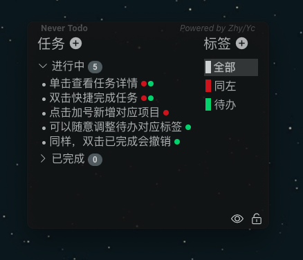
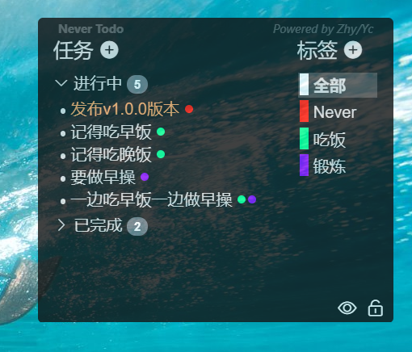

<div align=center></div>

# never-todo-client

> 一个基于electron-vue框架搭建的待办列表应用

[English](./README.md)/中文

此应用由[SpicyChickenFLY](https://github.com/SpicyChickenFLY)与[bluepongo](https://github.com/bluepongo)合作开发

这个待办列表系列应用包含以下产品
* [后端数据库（开发中）](https://github.com/SpicyChickenFLY/never-todo-backend) - 使用Golang进行开发
* [PC端（Win/Linux/Mac）（发布v0.0.1）](https://github.com/bluepongo/never-todo-client) - 使用Electron-Vue框架搭建
* [移动端（Android/IOS）（尚未开发）](https://github.com/SpicyChickenFLY/never-todo-mobile) - 使用Dart/Flutter搭建
* [数据格式转换器（尚未开发）](https://github.com/SpicyChickenFLY/never-todo-converter) - 使用Golang进行开发

PC端的设计思路和逻辑编写的大量灵感来自于[xhznl-todo-list](https://github.com/xiajingren/xhznl-todo-list)这个仓库，这个APP做的特别棒，但是因为没有标签功能所以我们重新设计了一个

## 使用方法

[](./USAGE.md)

## 截图展示

### MacOS

### Win10


## 实现功能
* [x] 添加新的待办、标签
* [x] 修改待办、标签内容
* [x] 删除待办和标签（软删除）
* [x] 将待办设置为重要并高亮显示
* [x] 为待办赋予或去除标签
* [x] 显示进行中和已完成的待办的数目、
* [x] 拖拽顶部移动窗口
* [x] 设置保持窗口显示在最前
* [x] 设置锁定窗口忽略鼠标事件
* [x] 利用lowdb增加 导入/导出/日志记录 功能
* [x] 设置开机启动功能

## 当前版本修复的问题
* [x] 修改优化UI，使其更加人性化
  * [x] 允许通过鼠标悬浮提示控件功能
  * [x] 设置 黑/白/绿/粉 四种背景主题
  * [x] 允许用户自行定义调试背景的透明度
  * [x] 允许设置待办列表不是总是显示在顶端
  * [x] 允许对窗口大小进行手动伸缩
* [x] 通过快捷键进行窗口的隐藏呼出
* [x] 另启一个实例时报错

## 下个版本做什么
* [ ] 优化数据库存储结构，减少磁盘空间占用
* [ ] 设置提醒时间，到时图标闪烁提醒
* [ ] 设计同步机制，与后端交互
* [ ] 修改优化UI，使其更加人性化
  * [ ] 修改标签调色盘的颜色配置
  * [ ] 可以点击窗口任意空白位置进行拖拽


#### 项目搭建

``` bash
# 安装项目依赖
npm install

# 运行开发环境
npm run dev

# 构建对应开发平台的二进制安装包
npm run build
```

---

This project was generated with [electron-vue](https://github.com/SimulatedGREG/electron-vue)@[8d4ed60](https://github.com/SimulatedGREG/electron-vue/tree/8d4ed607d65300381a8f47d97923eb07832b1a9a) using [vue-cli](https://github.com/vuejs/vue-cli). Documentation about the original structure can be found [here](https://simulatedgreg.gitbooks.io/electron-vue/content/index.html).
