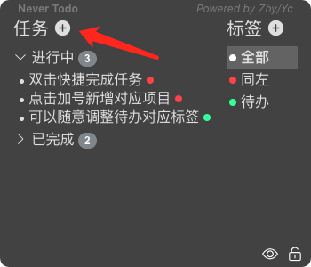
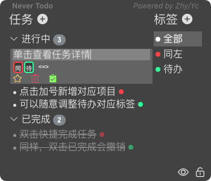
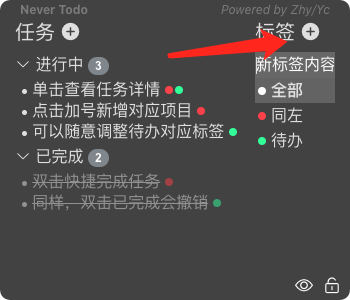
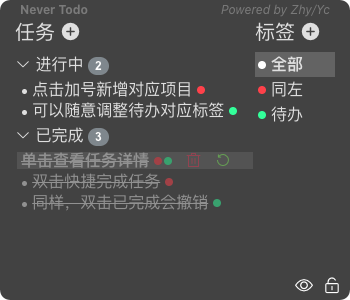
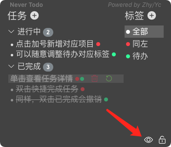
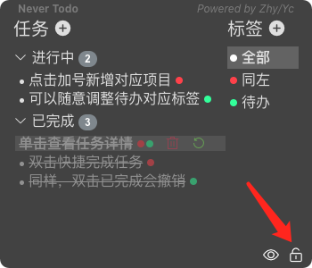
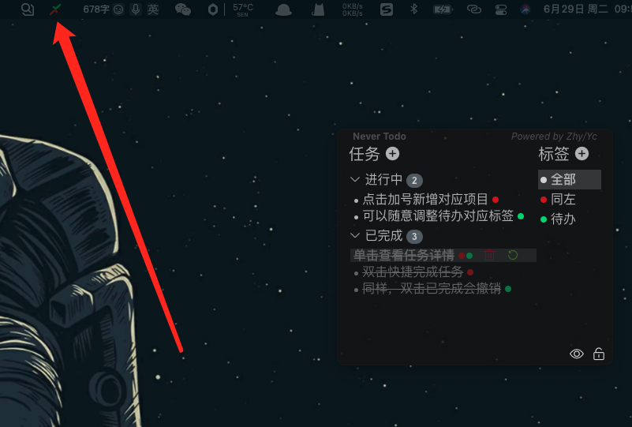

# 使用方法

## 添加任务

点击左侧"+"号，然后输入任务内容即可。

## 查看任务

单击【进行中】的任务即可查看任务详情。点击右边标签可以对具体任务设置标签。点击黄色星星按钮可将任务设置为重要事项；点击垃圾桶可删除任务；点击对勾或者双击任务可以完成任务。

## 添加标签

点击右侧"+"号可以添加标签，输入标签内容即可。

## 撤回已完成任务

点击绿色撤回按钮或双击任务，可将【已完成】任务撤回【进行中】。

## 最小化

点击左下角小眼睛图标即可。若想重新唤出界面，点击上方小图标（windows系统为右下角任务栏小图标）-显示界面。

## 锁定界面

点击右下角锁按钮，即可锁定界面。

## 设置开机启动

点击上方小图标（windows系统为右下角任务栏小图标）-勾选开机启动。

## 导入/导出数据

点击上方小图标（windows系统为右下角任务栏小图标）-选择导入、导出数据。

## 退出

点击上方小图标（windows系统为右下角任务栏小图标）-退出。